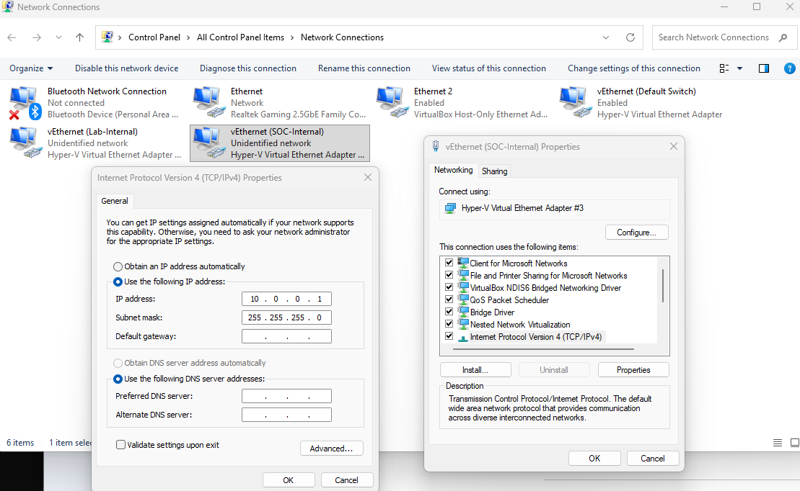
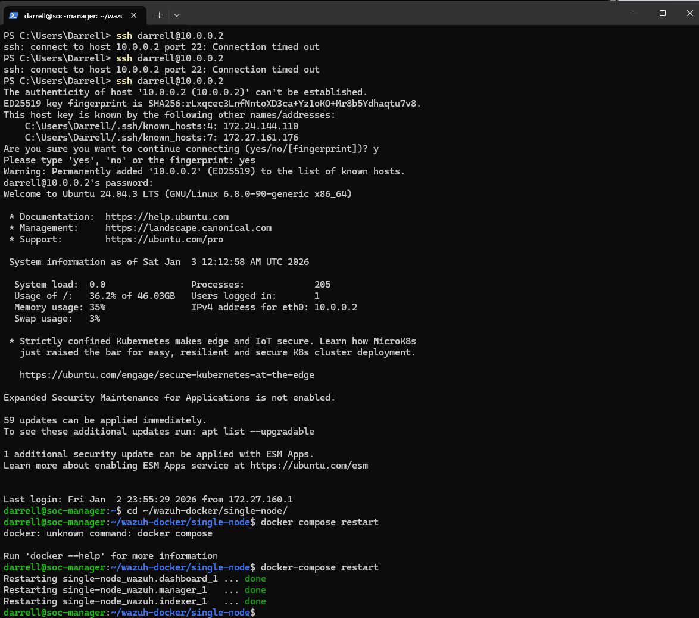
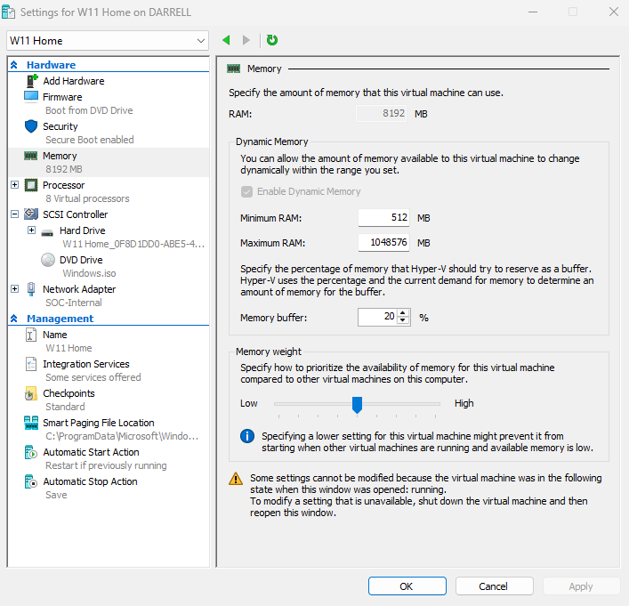
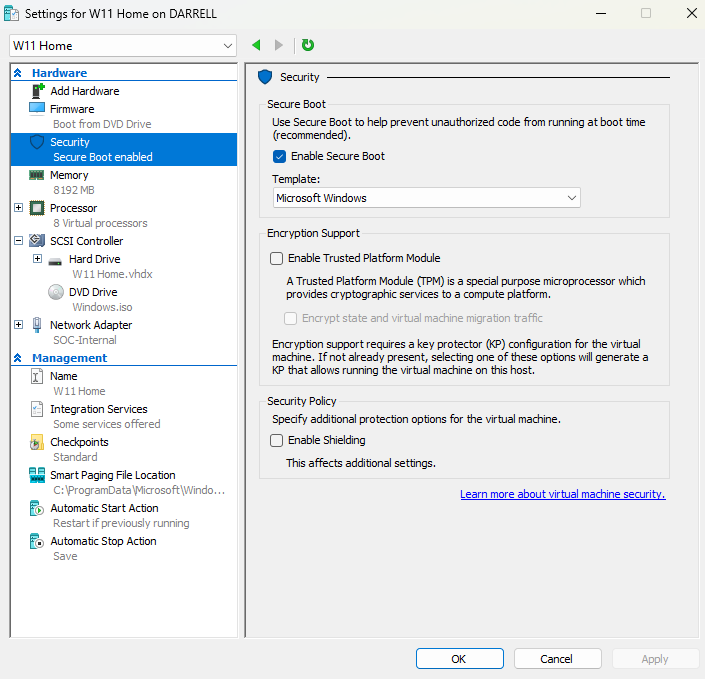
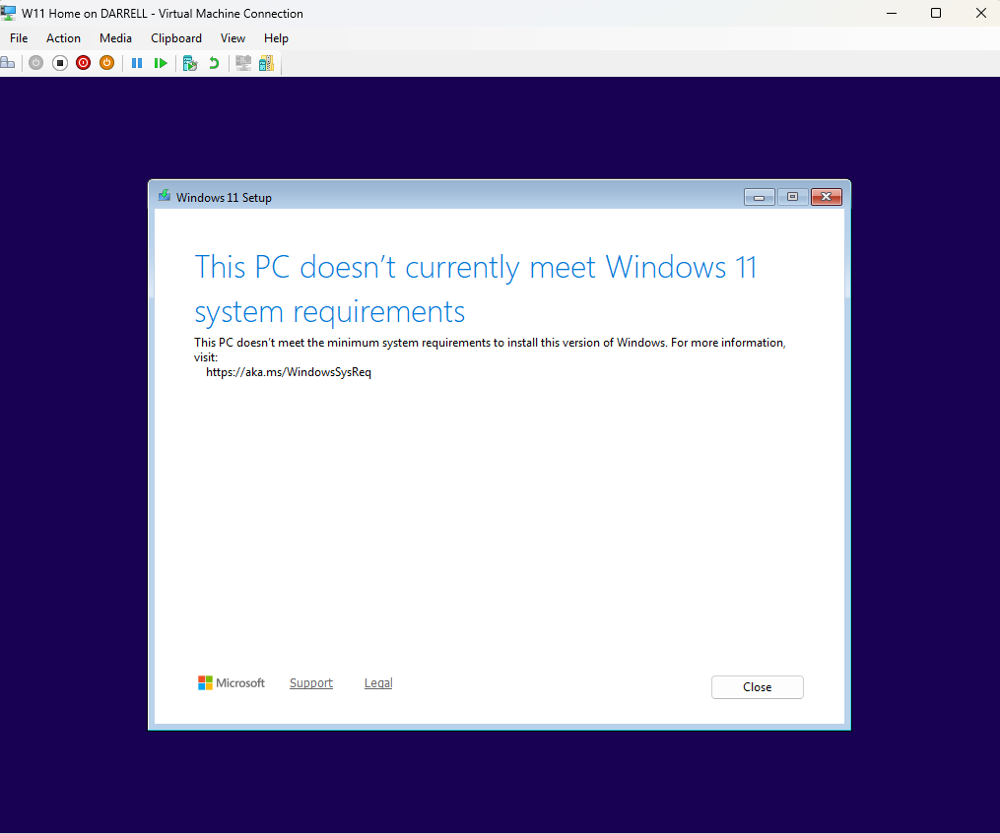
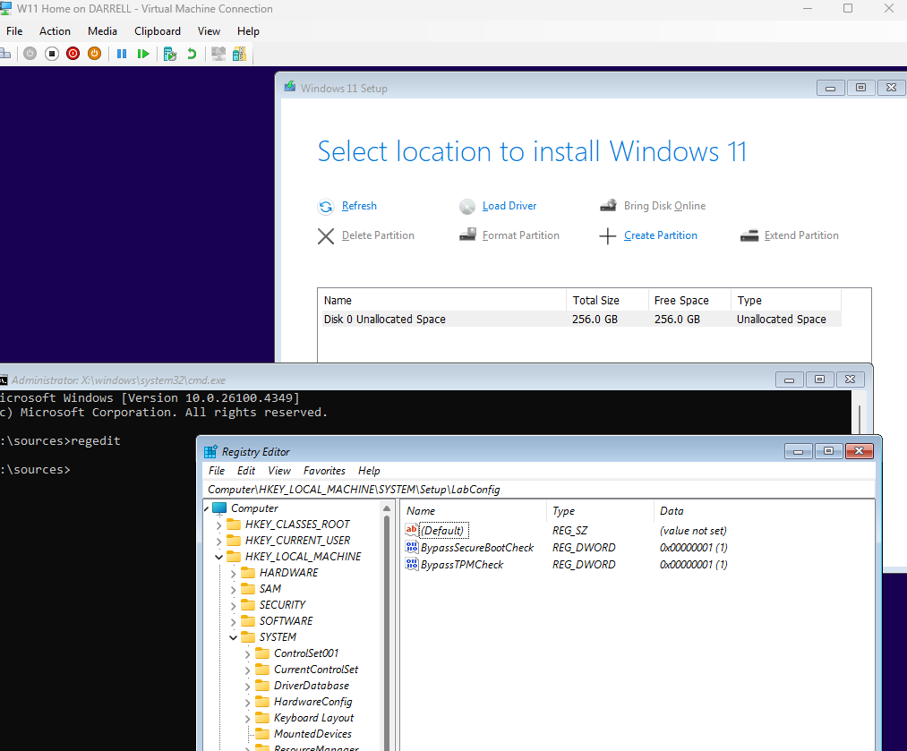

# SOC Automation Lab: Wazuh SIEM Deployment

## Phase 1: Network & Manager Setup
To establish a controlled environment for security monitoring, I configured a private virtual network and deployed the Wazuh Manager on an Ubuntu server.

### 1. Network Configuration
* **Internal Switch:** Created a Hyper-V Virtual Switch named `SOC-Internal` set to "Internal" to isolate lab traffic.
* **Static Addressing:** Configured the Ubuntu Manager with a static IPv4 address of `10.0.0.2`.

### 2. Wazuh Manager Deployment
* **Docker Orchestration:** Utilized a custom `docker-compose.yml` to provision the Wazuh indexer, manager, and dashboard.
* **Service Verification:** Successfully initialized the containers and verified that all management services were in a "Running" state.

---

## Phase 2: Target Endpoint Provisioning (Windows 11)
I deployed a Windows 11 Home VM to serve as the target endpoint for telemetry collection. This required manual environment manipulation to bypass modern hardware requirements.

### 1. Hardware Specification & Configuration
The VM was configured to mirror a high-performance endpoint to ensure stability during intensive security auditing:
* **Memory:** Allocated **8GB of RAM** (8192 MB) to prevent performance bottlenecks.
* **Processor:** Assigned **8 Virtual Processors** for smooth OS operation.

* **Security Layer:** Enabled **Secure Boot** and the **Trusted Platform Module (TPM)** within Hyper-V settings to meet Windows 11 security standards.

### 2. Troubleshooting: Bypassing System Requirements
During the initial boot, the installer triggered a "This PC doesn't meet system requirements" error.

**Resolution via Registry Injection:**
Instead of restarting, I intercepted the installation at the language selection screen to perform a manual bypass:
1. **Registry Access:** Launched `regedit` via the `Shift + F10` command prompt.
2. **Manual Bypass:** Created the `LabConfig` key in `HKLM\SYSTEM\Setup` and injected **DWORD** values for `BypassTPMCheck` and `BypassSecureBootCheck` set to **1**.

This allowed the installer to successfully initialize the virtual disk and proceed with the OS deployment.
